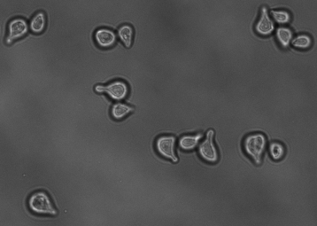
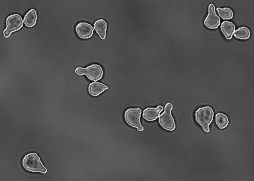
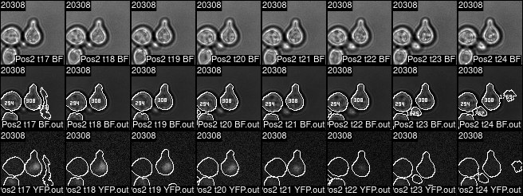
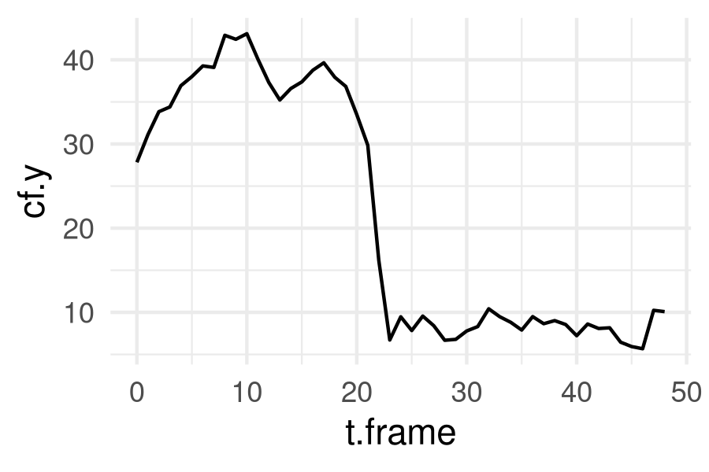

# rcell2.cellid - CellID wrapper package

This branch wraps [Cell-ID](https://github.com/darksideoftheshmoo/cellID-linux/tree/mask_mod) v1.5.0 into R.

rcell2's functionality is split into four packages:

* The main rcell2 package offers functions to load Cell-ID's output to data.frames, and image manipulation based on EBImage. A development version of this package is available in the [`rcell.dev`](https://github.com/darksideoftheshmoo/rcell2/tree/rcell2.dev) branch.
* Cell-ID, the image segmentation software, has been wrapped in the [`rcell.cellid`](https://github.com/darksideoftheshmoo/rcell2/tree/rcell2.cellid) package. It offers functions to run CellID from R, and an rmarkdown template showcasing advanced functionality.
* The cell tiling and graphic filtering apps, built on R-Shiny and [magick](https://github.com/ropensci/magick), are available in the [`rcell.magick`](https://github.com/darksideoftheshmoo/rcell2/tree/rcell2.magick) package.
* The [`rcell2.examples`](https://github.com/darksideoftheshmoo/rcell2.examples) package contains notebooks on general usage, and on several classification and analysis methods.

This package is very well tested in baker's yeast data, and R version 4+.

## CellID at a glance

Provide a _defocused_ brightfield image to CellID, and _voila_:

 

> Segmentation of yeast cells in a single position.

The image is segmented, cells are identified and tracked over time, and features are computed from morphology and fluorescent signal distribution.



> Time series images of one cell, showing different acquisition channels. 

With Rcell2, you can load an analize the CellID results freely, using standard R packages.



> Background corrected fluorescent signal concentration VS time, plotted with ggplot2.

## Usage

An Rmd notebook with minimal and detailed usage examples is available.

It is included as an Rmarkdown template,
and can also be opened in Rstudio with a convenience function:

```r
get_workflow_template_cellid()
```

This will either copy or download and open a Rmarkdown notebook,
with usage examples and brief explanations.

## Installation

Overview:

1. Install R dependencies (this step is automatic).
2. Install system dependencies (required to _make_ the CellID executable, otherwise optional).
3. Install the package with:

```r
remotes::install_github("darksideoftheshmoo/rcell2-cellid")
```

> Note that step 2 _can_ be skipped if you already have a CellID binary in your system,
but you will need to specify it's path in `cell2()`. If the binary is of an older version
of CellID, the new parameters in `cell2()` will not work.

### R Dependencies

Most of the R package dependencies are listed in the `DESCRIPTION` file,
and should install automatically.

We suggest installing the [```tidyverse```][1] meta-package 
(and use it, you'll not regret it) and [```devtools```][2].

```R
# Dependencies
install.packages(c("tidyverse", "devtools"))
```

### System dependencies for CellID

Obvious dependency: `R`

The package has some C library dependencies (such as `tiff`), 
needed to compile the bundled C code.

However, if compilation fails, the package will still install, 
and you will need a CellID binary to use `cell2()`.
In this case you can try compiling CellID yourself by visiting its repo (use the links [above](https://github.com/darksideoftheshmoo/rcell2/blob/rcell2.cellid/README.md#branch-notes)).

We do our best to support the three main OSes.
If something goes wrong, please [drop an issue](https://github.com/darksideoftheshmoo/rcell2/issues).

### GNU-Linux (Ubuntu, Arch, etc.)

Use your package manager to install some development libraries.
You will most likely only need `libtiff` and some standard C libraries.

On Ubuntu use `apt`:

`sudo apt install libtiff-dev libzstd-dev libjbig-dev libz-dev libjpeg-dev libwebp-dev`

On Arch use `pacman`:

`sudo pacman -S openlibm libtiff zstd zlib libwebp libjpeg-turbo xz`

Notes:

* Although this R package will try to compile the bundled `libtiff` if not found, we suggest you try installing `libtiff` in your system it first. You will otherwise need the `cmake` as an additional dependency.
* When compiling bundled `libtiff`, CellID is linked to the bundled `libtiff` statically, and for this we needed those extra dynamic links to `zstd`, `liblzma`, `libjpeg`, `libz`, and `libwebp` (which become system dependencies).

### Mac OS

You will most likely only need `libtiff` for this package, and `imagemagick` for `rcell2.magick`. Install Homebrew and use `brew install libtiff`.

If brew's `libtiff` does not work, use `brew` to install the dependencies listed previously for GNU-linux (including `cmake`).

Trying to install source packages in _Catalina_ will prompt users to install (¿xcode?) command line developer tools such as `make`, which may be required.

### Windows

The package automatically downloads and links the `libtiff` library.

You need to install `Rtools`: https://cran.r-project.org/bin/windows/Rtools/

Apparently it works just fine, we thank the devs of the [ijtiff](https://github.com/ropensci/ijtiff) package for [this](https://github.com/ropensci/magick/blob/master/tools/winlibs.R) :).


### Using an external CellID binary (optional)

The `cell2()` function can be used to run any CellID binary directly from R, effectivley wrapping it.

It supports newer CellID features, available at the repo's `mask_mod` [branch](https://github.com/darksideoftheshmoo/cellID-linux/tree/mask_mod).

Older CellID versions (< 1.4.6) may work, as long as the new features are not enabled in `cell2()`.

Visit the CellID repository to find standalone installation instructions (links [above](https://github.com/darksideoftheshmoo/rcell2/blob/rcell2.cellid/README.md#branch-notes)).

### CellID installation notes

You can try out the CellID binary in the R package library directory,
after installation of this package.

Once you've installed the package, 
the binary's path can be obtained with:

```r
system.file("bin/cell", package = "rcell2.cellid", mustWork = T)
```

It is automatically used by `cell2()`.

However, if CellID's compilation fails, this package will still install.
In that case you can compile the program yourself by visiting its repo, and following the README's instructions:

* CellID 1.5+: https://github.com/darksideoftheshmoo/cellID-linux/tree/mask_mod
* CellID 1.4.6: https://github.com/darksideoftheshmoo/cellID-linux

## Installing the package

Install using `remotes`, directly from the github repo:

```r
remotes::install_github("darksideoftheshmoo/rcell2-cellid")
```

## CellID compilation notes

CellID is a C program, compiled during package installation, and is linked to several dynamic libraries.

The `libm` library is the standard math C library, and `zlib` a compression library, both required by CellID.

The `libtiff` library is optionally compiled and statically linked during installation, or used automatically if avaiable in the system.
In the former case, only these CFLAGS must be available: `-lm -lz -ltiff`.

We [check](https://github.com/darksideoftheshmoo/rcell2/blob/e1cb2572bc00aa1774da2b89e89e2ef228090f45/src/Makevars#L12) if `libtiff` is available in your system. If not found, a bundled library is compiled internally with `cmake`, before trying to compile CellID.

When using the bundled `libtiff`, CellID is linked to it statically, and for this we needed the extra dynamic links to `zstd`, `liblzma`, `libjpeg`, `libz`, `libwebp`, and `libm`. These CFLAGS must be available: `-lzstd -llzma -ljbig -ljpeg -lz -lm -lwebp`.

Minimal `gcc` links:

* `ltiff`: tiff library.
* `lm`: math library.
* `lz`: zlib compression library.

For compiling the bundled `libtiff`, you may also require:

* `lzstd`
* `llzma`
* `ljbig`
* `ljpeg`
* `lwebp`

# New tools in `rcell2`

Besides the `rcell2.cellid` package, the following is new.

## R-Shiny and `magick` tools for cytometry data

Check out the [`rcell2.magick`](https://github.com/darksideoftheshmoo/rcell2-magick) repo.

## _Tidy_ analysis framework for CellID's data

Check out the master branch, or the [`rcell2.dev`](https://github.com/darksideoftheshmoo/rcell2/tree/rcell2.dev) branch.

## Hu Moment functions for raw cell segmentation data

Check out the [`rcell2.dev`](https://github.com/darksideoftheshmoo/rcell2/tree/rcell2.dev) branch.

## K-means filtering functions

Check out the [`rcell2.dev`](https://github.com/darksideoftheshmoo/rcell2/tree/rcell2.dev) branch.

# Notes & refs


[1]:https://www.tidyverse.org/
[2]:https://github.com/r-lib/devtools
[3]:https://bioconductor.org/packages/release/bioc/html/EBImage.html
